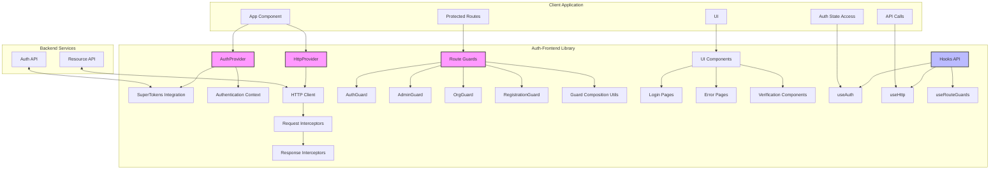
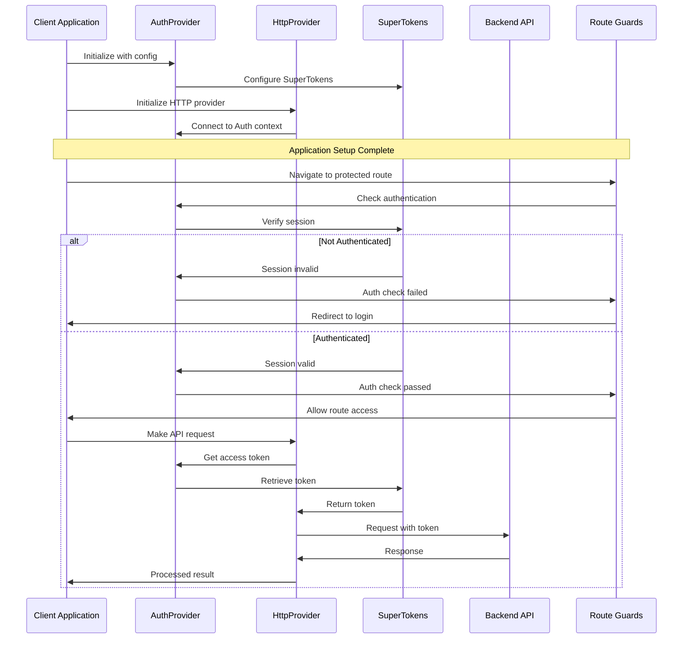
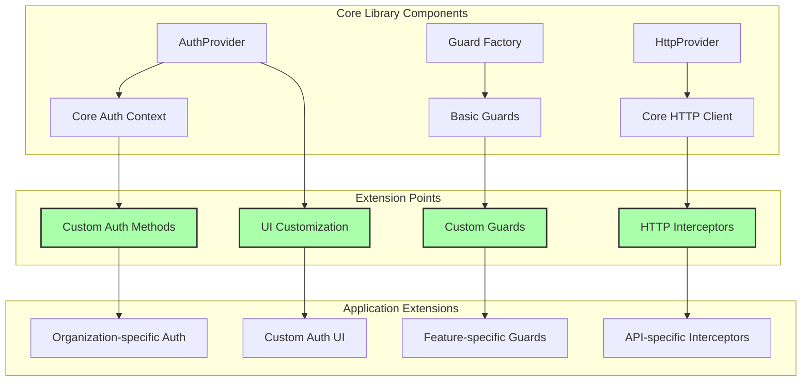
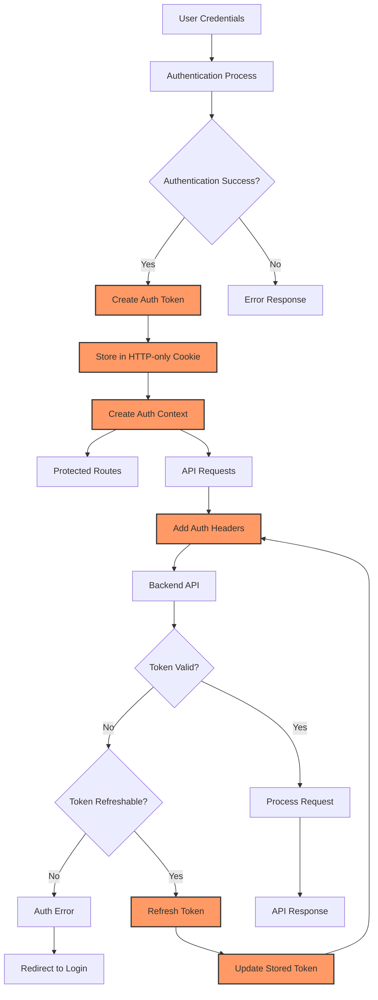
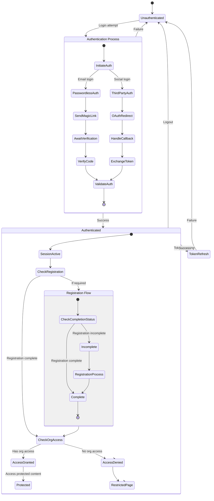

# Feature: Authentication Frontend Library

---

## Requirements

## Business Requirement

A comprehensive, reusable authentication and authorization solution for all FlytBase frontend applications that provides secure, consistent, and user-friendly authentication flows.

### User Stories

- As a user, I want to securely log in to the application using either email or third-party providers so that I can access my account
- As a developer, I want to easily protect routes and API calls so that users can only access appropriate resources
- As an administrator, I want to control which users have access to specific features so that permissions are properly enforced
- As a user, I want a clear error message when authentication fails so that I know how to resolve the issue
- As a platform provider, I want consistent authentication flows across all apps so that users have a streamlined experience

## Impact Analysis

### Affected Components

- All frontend applications in the FlytBase ecosystem
- Backend authentication services
- API gateway and HTTP request handling
- User onboarding flows

### Dependencies

- SuperTokens for token management
- TanStack Router for route management
- Axios for HTTP requests
- React Context API for state management

### Performance Considerations

- Token refresh strategy should minimize API calls
- Authentication checks should be efficient to avoid UI delays
- Token storage should follow security best practices

### Security Considerations

- Secure token storage in HTTP-only cookies
- Token expiration and refresh mechanisms
- Multi-tenant isolation
- Prevention of authentication bypass

### Backwards Compatibility

- Should be compatible with existing API endpoints

---

## Architecture

### High-Level Design

The auth-frontend library is structured around a layered architecture:

1. **Core Authentication Layer**:

   - Auth Provider with React Context
   - SuperTokens integration
   - Session management

2. **HTTP Layer**:

   - Authenticated HTTP client
   - Request/response interceptors
   - Error standardization

3. **Route Protection Layer**:

   - Guard-based route protection
   - Composable protection rules
   - Integration with router libraries

4. **UI Components Layer**:
   - Login and verification pages
   - Error pages
   - Registration flow components

```
┌────────────────┐      ┌───────────────────┐      ┌─────────────────┐
│                │      │                   │      │                 │
│  Auth Methods  │◄────►│  AuthProvider     │◄────►│  SuperTokens    │
│                │      │                   │      │                 │
└────────────────┘      └───────────────────┘      └─────────────────┘
        ▲                        ▲
        │                        │
        ▼                        ▼
┌────────────────┐      ┌───────────────────┐      ┌─────────────────┐
│                │      │                   │      │                 │
│  Auth Hooks    │◄────►│  Component Guards │◄────►│  Route Guards   │
│                │      │                   │      │                 │
└────────────────┘      └───────────────────┘      └─────────────────┘
        ▲                        ▲                         ▲
        │                        │                         │
        ▼                        ▼                         ▼
┌────────────────┐      ┌───────────────────┐      ┌─────────────────┐
│                │      │                   │      │                 │
│   HTTP Client  │◄────►│   UI Components   │◄────►│  Error Handling │
│                │      │                   │      │                 │
└────────────────┘      └───────────────────┘      └─────────────────┘
```

### Data Model Changes

No database changes are required as this is a frontend library. However, it expects the following data structures in authentication tokens:

- `user_id`: Unique identifier for the user
- `user_type`: User type (e.g., "ADMIN", "SUPER_ADMIN", "USER")
- `org_id`: Organization identifier for multi-tenant functionality

### API Changes

The library expects the following endpoints to be available:

- `/auth/signin` - Authentication endpoint
- `/auth/signout` - Logout endpoint
- `/auth/session/refresh` - Token refresh endpoint
- `/auth/user/info` - User information
- `/auth/organization/check` - Organization validation

### Component Interactions

1. **AuthProvider**:

   - Initializes SuperTokens
   - Provides authentication context
   - Handles login/logout flows
   - Manages token refresh

2. **HttpProvider**:

   - Creates Axios instance with interceptors
   - Adds auth token to requests
   - Handles token refresh on 401 errors
   - Manages organization ID in headers

3. **Route Guards**:

   - Protect routes based on authentication state
   - Redirect to appropriate pages for unauthorized access
   - Combine multiple protection rules (auth + admin + org)

4. **UI Components**:
   - Display authentication forms
   - Handle error states
   - Manage verification flows

### Diagrams

#### Architecture Component Diagram



#### Integration Flow Diagram



#### Extension Pattern Diagram



#### Data Flow Diagram



#### Activity Diagram for Authentication Flow



---

## Implementation

### Technical Approach

The library uses a React Context-based approach with hooks for accessing authentication state and functionality. SuperTokens is used for token management, providing secure token storage and refresh capabilities.

Guard functions provide a flexible, composable approach to route protection, supporting both component-level and route-level protection patterns.

### Technology Choices

1. **SuperTokens**

   - Provides secure token management
   - Handles token refresh automatically
   - Implements best practices for token storage
   - Supports multiple authentication recipes (Passwordless, ThirdPartyEmailPassword)
   - Enables multi-tenant authentication

2. **React Context API**

   - Manages global auth state
   - Provides access to auth methods
   - Avoids prop drilling
   - Enables component composition

3. **Axios**

   - Configurable HTTP client
   - Supports interceptors for auth headers
   - Standardized error handling
   - Type-safe request/response handling

4. **TanStack Router**
   - Modern, type-safe routing
   - Supports route loaders and guards
   - Flexible route configuration
   - Integration with auth context

### Code Structure

```
/auth-frontend
  /components        # Authentication UI components
    AuthPage.tsx     # Main auth page
    PasswordlessAuth.tsx  # Email login
    ThirdPartyAuth.tsx    # Social login
    ...
  /config
    SuperTokensConfig.ts  # SuperTokens configuration
  /guards            # Route protection
    authGuard.ts     # Basic auth guard
    adminGuard.ts    # Admin-only guard
    orgGuard.ts      # Organization guard
    ...
  /hooks             # Custom React hooks
    useAuth.ts       # Access auth context
    useHttp.ts       # Access HTTP client
    useRouteGuards.ts # Guard composition
  /providers         # Context providers
    AuthProvider.tsx # Main auth provider
    HttpProvider.tsx # HTTP client provider
  /utils             # Utility functions
    httpClient.ts    # HTTP client creation
    httpErrors.ts    # Error handling
  index.ts           # Public API
```

### Key Algorithms/Processes

1. **Authentication Flow**

   - User initiates login with email or social provider
   - System validates credentials or sends magic link
   - User completes verification
   - Token is stored and user redirected to app

2. **Token Refresh**

   - HTTP client detects 401 error
   - Attempts token refresh via SuperTokens
   - If successful, retries original request
   - If refresh fails, redirects to login

3. **Guard Composition**
   - Multiple guards can be combined
   - Guards execute in sequence
   - Each guard can throw redirects
   - All guards must pass for access

### Configuration Details

The library requires the following configuration:

```typescript
const authConfig = {
  appInfo: {
    appName: 'MyApp', // Application name
    apiDomain: 'https://api.example.com', // API domain
    websiteDomain: 'https://example.com', // Frontend domain
    apiBasePath: '/auth', // Auth API path
    websiteBasePath: '/', // Frontend base path
    tenantId: 'my-tenant', // Default tenant ID
    devOrgId: 'dev-org-id', // Development org ID
    loginAppUrl: 'https://login.example.com', // Login app URL
  },
  localDeployment: boolean, // Local deployment flag
};
```

### Quick Start Guide

#### 1. Application Setup

```tsx
// App.tsx
import { AuthProvider, HttpProvider } from 'auth-frontend';

function App() {
  return (
    <AuthProvider authConfig={authConfig}>
      <HttpProvider>
        <RouterProvider router={router} />
      </HttpProvider>
    </AuthProvider>
  );
}
```

#### 2. Protected Routes

```tsx
// With TanStack Router
import { createRouteLoader, requireAuth } from 'auth-frontend';

export const Route = createFileRoute('/dashboard')({
  component: DashboardPage,
  beforeLoad: createRouteLoader(requireAuth),
});

// Combine multiple guards
const adminGuard = combineGuardFunctions(requireAuth, requireSuperAdmin);
```

#### 3. Using Auth State

```tsx
// In components
import { useAuth } from 'auth-frontend';

function ProfileComponent() {
  const { isAuthenticated, userId, logout } = useAuth();

  return isAuthenticated ? (
    <div>
      <p>User ID: {userId}</p>
      <button onClick={logout}>Logout</button>
    </div>
  ) : (
    <div>Please log in</div>
  );
}
```

#### 4. API Requests

```tsx
// Authenticated requests
import { useHttp } from 'auth-frontend';

function DataComponent() {
  const http = useHttp();

  async function fetchData() {
    try {
      // Token and org ID automatically included
      const response = await http.get('/api/data');
      return response.data;
    } catch (error) {
      // Error handling
    }
  }
}
```

## Integration

### Integration Points

1. **App Initialization**

   - Wrap application with `AuthProvider` and `HttpProvider`
   - Configure authentication settings
   - Connect with router if needed
   - Optionally set up debug mode with `debug` prop in HttpProvider

2. **Auth Page Implementation**

   - New applications MUST implement the following auth routes:
     - `/login`: Using the `LoginWrapper` component
     - `/signup`: Using the `Signup` component
     - `/logout`: Using the `LogoutPage` component
     - `/auth/callback/google`: For Google OAuth callback processing
     - `/verify`: For email verification flow
     - `/link-sent`: Confirmation page after verification link is sent
     - `/user-registration/*`: Required user registration flow routes
   - All auth components should be imported directly from the auth-frontend library
   - No custom implementation is needed as these components are ready to use

3. **Route Protection**

   - Define protected routes with guards
   - Create custom guard combinations as needed
   - Handle authentication redirects
   - Implement registration and organization guards

4. **API Integration**

   - Use `useHttp` hook for API calls
   - Auth tokens automatically added to requests
   - Handle standardized error responses
   - Add custom request/response interceptors

5. **Router Integration**

   - Connect the auth context to your router via `routerConfig` prop
   - Update router context when auth state changes
   - Access auth context in route components
   - Protected routes should use `beforeLoad` hook with `createRouteLoader` and guard functions

6. **Error Handling Integration**
   - Standardized error types in `HttpErrorType` enum
   - Special handling for authentication errors
   - Automatic redirection for email verification issues
   - Custom error pages for different auth scenarios

### Multi-tenant Integration

The library supports multi-tenant applications through:

1. **Organization ID Management**

   - Store organization ID in auth context
   - Include organization ID in API requests
   - Check organization access with `requireOrg` guard

2. **Subdomain-based Organization Resolution**

   - Automatic lookup of organization by subdomain
   - Fallback to development organization for localhost
   - Organization status checks (found/not found/empty)

3. **Cross-Origin Authentication**
   - Origin token generation for cross-domain auth
   - Token encoding/decoding utilities
   - Tenant-aware authentication flows

### Email Verification Flow

The library includes a complete email verification system:

1. **Verification Detection**

   - Automatic detection of unverified email
   - Special handling of 403 UNVERIFIED_EMAIL errors
   - Redirect to verification page

2. **Verification Process**

   - Send verification email component
   - Verification code entry
   - Verification status checking

3. **Verification Guards**
   - Guards to enforce email verification
   - Combine with other guards for complex scenarios

### Third-Party Services

1. **SuperTokens**

   - Token management
   - Session handling
   - Authentication flows

2. **OAuth Providers**
   - Google login integration
   - Microsoft login integration
   - Other social login providers

---

## Available Components and Hooks

### Authentication Components

1. **Login Components**

   - `PasswordlessAuth` - Email-based login with magic links
   - `ThirdPartyAuth` - Social login buttons and UI
   - `OnPremLogin` - Special login for on-premises deployments
   - `AuthPage` - Container for authentication UI

2. **Verification Components**

   - `LinkSentPage` - Shown after sending magic link
   - `VerifyAuth` - Verification code entry
   - `ThirdPartyAuthCallback` - Handler for OAuth callbacks
   - `SendVerificationEmail` - Email verification request UI

3. **Error and Status Pages**

   - `LoginErrorPage` - Authentication error display
   - `RestrictedPage` - Access denied page
   - `OrgNotFoundPage` - Organization not found
   - `VerificationRequiredPage` - Email verification required

4. **User Registration Flow**

   - `RegistrationForm` - Basic user registration
   - `TermsAcceptance` - Terms and conditions acceptance
   - `AdditionalInfoForm` - Additional user information collection
   - `RegistrationCompletePage` - Registration completion confirmation

5. **Route Protection Components**
   - `ProtectedRoute` - Basic authentication wrapper
   - `AdminRoute` - Admin-only route wrapper
   - `OrgRoute` - Organization-specific route wrapper

### React Hooks

1. **`useAuth`**

   - Access authentication state and methods
   - Get current user information
   - Check authentication status
   - Perform logout

2. **`useHttp`**

   - Access the authenticated HTTP client
   - Make API requests with auth headers
   - Handle standardized error responses
   - Type-safe request and response handling

3. **`useRouteGuards`**
   - Access route protection guards with auth context
   - Combine multiple guards with `combineGuards`
   - Create custom guards for specific scenarios
   - Preset guard combinations like `authAndAdminGuard`

## Extension Points

The library is designed to be extended in several ways:

### 1. Custom Authentication Methods

You can extend the `AuthProvider` with custom authentication methods:

```tsx
const MyAuthProvider = ({ children }) => {
  // Get base auth functionality
  const baseAuth = useAuthBase();

  // Add custom auth methods
  const customAuth = {
    ...baseAuth,
    loginWithCustomProvider: async () => {
      // Custom login implementation
    },
    checkCustomClaims: async () => {
      // Custom claims validation
    },
  };

  return <AuthContext.Provider value={customAuth}>{children}</AuthContext.Provider>;
};
```

### 2. Custom HTTP Interceptors

You can add custom interceptors to the HTTP client:

```tsx
import { createHttpClient } from 'auth-frontend';

// Create the base client
const client = createHttpClient(baseUrl, orgId);

// Add custom request interceptor
client.interceptors.request.use(
  (config) => {
    // Add custom headers or modify request
    config.headers['Custom-Header'] = 'value';
    return config;
  },
  (error) => Promise.reject(error)
);

// Add custom response interceptor
client.interceptors.response.use(
  (response) => {
    // Process or transform response
    return response;
  },
  (error) => {
    // Custom error handling
    return Promise.reject(error);
  }
);
```

### 3. Custom Route Guards

Create custom guards using the guard utilities:

```tsx
import { createGuard, GuardContext } from 'auth-frontend';

// Create a feature-specific guard
export const requireFeatureAccess = createGuard(async ({ accessToken, http }: GuardContext) => {
  // Verify feature access
  const token = await accessToken();
  const response = await http.get('/api/features/access');

  if (!response.data.hasAccess) {
    throw redirect({ to: '/feature-restricted' });
  }
});

// Use in your routes
const featureGuard = combineGuards(authGuard, requireFeatureAccess);
```

### 4. SuperTokens Recipe Customization

You can customize the SuperTokens recipes:

```tsx
import { setAuthConfig } from 'auth-frontend';

setAuthConfig({
  appInfo: {
    // Base config
  },
  recipeList: [
    // Custom recipe configurations
    ThirdPartyEmailPasswordNode.init({
      signInAndUpFeature: {
        providers: [
          // Custom provider configuration
        ],
      },
    }),
    // Other custom recipes
  ],
});
```

## Testing Strategy

### Unit Testing

- Test individual hooks and utilities
- Mock authentication context
- Verify guard logic with different contexts
- Test HTTP client interceptors
- Validate token management logic

### User Acceptance Testing

- Verify login flows are intuitive
- Ensure error messages are clear
- Verify email verification workflow

---

### Feature Toggles

- `localDeployment` flag for development environments
- Configuration options for different authentication methods

### Database Migrations

Not applicable - frontend library only.

### Monitoring

- Monitor authentication success/failure rates
- Track token refresh operations
- Monitor unauthorized access attempts
- Log authentication errors

---

## Decision Log

### Key Decisions

1. **Use SuperTokens over custom token implementation** - [2025-03-15] - SuperTokens provides a secure, well-tested implementation of token management with features like automatic refresh.

2. **Context-Based State Management** - [2025-03-20] - Using React Context for auth state management keeps authentication concerns encapsulated and avoids dependencies on external state libraries.

3. **Hooks-Based API** - [2025-03-22] - Exposing functionality through hooks offers better typing, easier composition, and aligns with modern React practices.

4. **Flexible Route Protection** - [2025-03-25] - Supporting multiple route protection patterns allows integration with different routing libraries and developer preferences.

### Alternative Approaches Considered

1. **Redux for State Management**

   - Considered using Redux for auth state
   - Would increase bundle size and add complexity
   - Context API provides sufficient functionality with less overhead

2. **JWT Decode in Frontend**

   - Considered decoding tokens directly in frontend
   - Security concerns with token validation
   - SuperTokens provides more secure approach

3. **Higher-Order Components for Protection**
   - Considered HOC pattern for route protection
   - Less flexible than hook-based approach
   - More difficult to compose multiple protection rules

---

## Review Notes

To be filled after implementation review.

---

## Post-Implementation

### Success Metrics

- Reduced authentication-related issues across applications
- Developer adoption and satisfaction with API
- Improved user experience in authentication flows
- Reduced code duplication across projects

### Follow-up Tasks

- Enhance registration flow components
- Add additional third-party providers
- Improve analytics for authentication events
- Develop more comprehensive error handling
